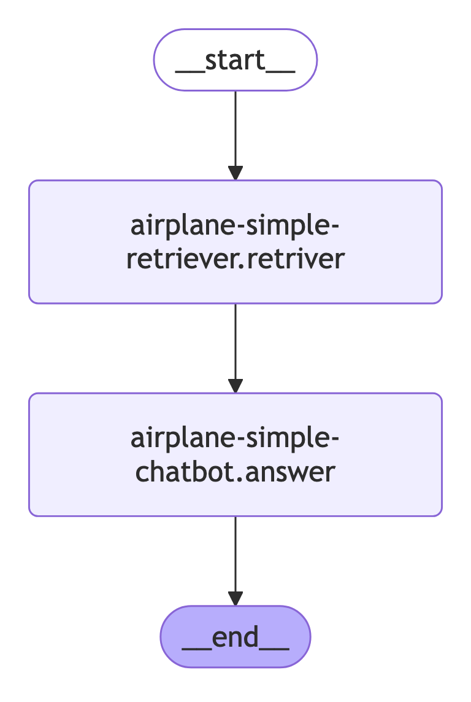

# Airplane Simple Chatbot

A simple chatbot implementation that processes and answers questions about airplanes.

## Overview

This project consists of two main components:

1. A retriever module that fetches relevant information
2. A chatbot module that processes and generates answers

Below is the high-level flow diagram of the system:



## Getting Started

To use this chatbot:

```bash
uv sync
```

```bash
source ./.venv/bin/activate

```

```bash
pyapp-cli run

```

```bash
inference
```
